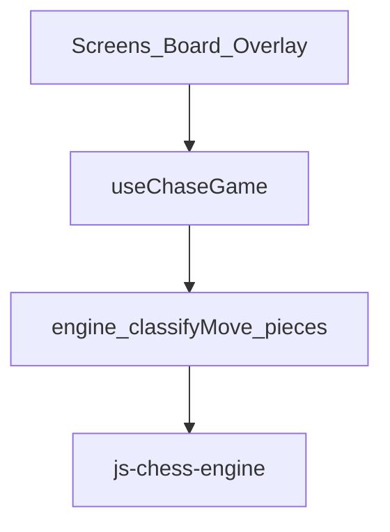
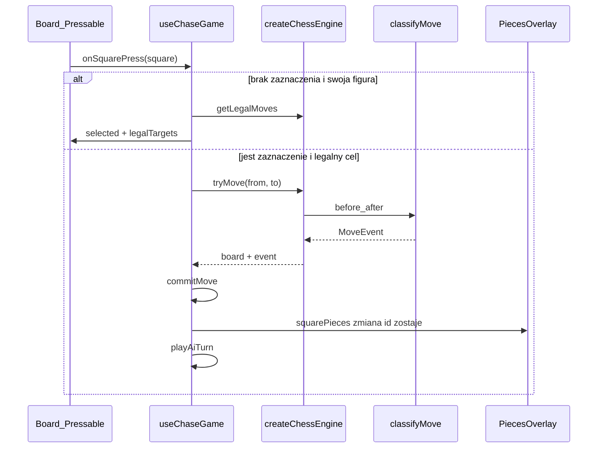
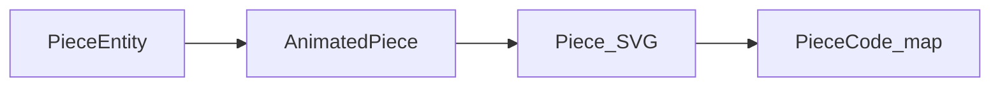

# Jak działa SWM Reanimated Chess

Ten dokument jest lekcją, nie katalogiem API. Cel: żebyś rozumiał **co tu się dzieje**, **dlaczego tak**, i **gdzie dopiąć animacje** — bez odtwarzania vibe-session z pamięci.

Czytaj od góry. Każdy rozdział buduje na poprzednim.

---

## 1. Po co to jest i jak myśleć o projekcie

**Cel aplikacji:** gra w szachy przeciwko AI, z UI w React Native (Expo 57), z figurami przygotowanymi pod Reanimated.

Zanim wejdziesz w pliki, trzymaj w głowie jedną zasadę:

> **Silnik jest synchroniczny i głupi względem UI. React trzyma dwa stany. Overlay animuje tożsamość figur, nie „kod na polu”.**

Warstwy wyglądają tak:



| Warstwa | Rola | Czego nie robi |
|---------|------|----------------|
| UI (`screens/`, `components/chess/`) | Rysuje planszę, przyjmuje tapy, pokazuje figury | Nie zna reguł szachów |
| Hook (`useChaseGame`) | Orchestracja: wybór figury, ruch gracza, AI, `busy` | Nie renderuje SVG |
| `src/chess/*` | Fasada silnika, klasyfikacja ruchu, mapa encji | Nie zna Reanimated ani React |
| `js-chess-engine` | Reguły, legal moves, AI | Nie wie nic o Twoim UI |

Jeśli coś „nie gra” przy animacjach, prawie zawsze problem jest na styku **hook ↔ overlay**, nie w bibliotece szachów.

---

## 2. Mapa `src/` — po co istnieje każdy folder

Nie musisz znać każdego pliku na pamięć. Musisz wiedzieć, **gdzie szukać**.

| Folder | Po co istnieje |
|--------|----------------|
| `src/chess/` | Domaina szachów niezależna od React: silnik, `MoveEvent`, encje figur, geometria `square → px` |
| `src/hooks/` | Stan gry i sekwencja tur (`useChaseGame`) |
| `src/components/chess/` | Widok planszy: kratka, overlay, SVG, animated slot |
| `src/screens/` | Ekrany nawigacji (Home / Game / GameOver / Settings) |
| `src/navigation/` | Stack navigator |
| `src/types/` | Typy ambient (`js-chess-engine`, SVG) + typy nawigacji |
| `src/assets/pieces/` | Pliki SVG białych i czarnych figur |

**Najważniejsze pliki do czytania w tej kolejności:**

1. `src/chess/types.ts` — kontrakt ruchu  
2. `src/chess/pieces.ts` — tożsamość figur  
3. `src/chess/engine.ts` + `movesDiff.ts` — skąd bierze się `MoveEvent`  
4. `src/hooks/useChaseGame.ts` — życie partii  
5. `src/components/chess/Board.tsx` → `PiecesOverlay.tsx` → `AnimatedPiece.tsx`

---

## 3. Lekcja najważniejsza: dwa źródła prawdy

W `useChaseGame` żyją **dwa** stany związane z pozycją:

| Stan | Typ | Po co |
|------|-----|--------|
| `board` | `BoardConfig` z silnika | Tura, wynik, legalność, kropki/ringi na polach |
| `squarePieces` | `SquarePieces` | Stabilne encje z `id` → klucze React → animacja |

### Czym jest `PiecesMap` silnika?

Silnik myśli tak:

```ts
pieces: { E2: "P", E7: "p", ... }  // pole → kod figury
```

To wystarczy do reguł. **Nie wystarczy do animacji.**

Dlaczego? Bo „pion na E2” i „ten sam pion na E4” to w mapie silnika dwa różne wpisy. Nie ma pojęcia *tej samej* figury, która się przemieściła — jest tylko „na E2 nic, na E4 jest P”.

### Czym jest `PieceEntity`?

```ts
type PieceEntity = {
  id: PieceId;      // np. "E2:P" nadane przy starcie
  code: PieceCode;  // "P", "k", ...
  square: Square;   // aktualne pole
};

type SquarePieces = Partial<Record<Square, PieceEntity>>;
```

Przy starcie budujesz mapę raz (`piecesMapToSquareMap`). Potem **nie przebudowujesz jej z `board.pieces`**. Aktualizujesz przez ruch:

```ts
setSquarePieces((prev) => applyMoveToSquareMap(prev, event));
```

`applyMoveToSquareMap` **przenosi ten sam obiekt/`id`** z pola `from` na `to` (przy promocji zmienia tylko `code`).

### Decyzja: incremental update vs rebuild

| Podejście | Co się dzieje | Skutek dla UI |
|-----------|----------------|---------------|
| Odrzucone: po każdym ruchu `piecesMapToSquareMap(board.pieces)` | Nowe `id` = `` `${nowePole}:${kod}` `` | React widzi nowy `key` → **remount** → brak ciągłości do animacji |
| Wybrane: `applyMoveToSquareMap(prev, event)` | Ten sam `id`, nowe `square` | Ten sam komponent jedzie z A→B → **można `withTiming`** |

To jest fundament całego setupu pod Reanimated. Bez stabilnego `id` reszta architektury (overlay, shared values) niewiele daje.

`commitMove` w hooku robi obie aktualizacje razem:

```ts
onMove?.(event);
setSquarePieces((prev) => applyMoveToSquareMap(prev, event));
setBoard(nextBoard);
```

---

## 4. Lekcja: `MoveEvent` jako kontrakt animacji

Pliki: `src/chess/types.ts`, `movesDiff.ts`, używane w `engine.ts`.

### Po co osobny event, skoro mamy nową planszę?

Bo UI potrzebuje wiedzieć **jak** zmieniła się pozycja, nie tylko **jak wygląda teraz**.

```ts
type MoveKind =
  | "quiet"
  | "capture"
  | "enPassant"
  | "castle"
  | "promotion";

type MoveEvent = {
  from: Square;
  to: Square;
  kind: MoveKind;
  piece: PieceCode;
  captured?: PieceCode;
  rookFrom?: Square;
  rookTo?: Square;
  promotedTo?: PieceCode;
};
```

### Co każdy kind znaczy dla UI

| Kind | Co się dzieje na planszy | Co animacja powinna zrobić |
|------|--------------------------|----------------------------|
| `quiet` | Figura `from` → `to` | Jedna figura, slide |
| `capture` | Zniknięcie zbitej na `to`, ruch atakującego | Fade/remove zbitej + slide |
| `enPassant` | Zbicie z **innego** pola niż `to` | Slide piona + usunięcie z pola obok |
| `castle` | Król + wieża (`rookFrom` → `rookTo`) | Dwie animacje równolegle |
| `promotion` | Ruch (+ opcjonalne bicie) + zmiana `code` | Slide, potem swap SVG / krótki scale |

### Skąd się bierze event?

W `engine.ts`, przy `tryMove` / `playAi`:

1. Snapshot `before`  
2. Mutacja w `js-chess-engine` (`game.move` / `game.aiMove`)  
3. Snapshot `after`  
4. `classifyMove(before, after, from, to)` → `MoveEvent`

### Decyzja: classify w domenie vs diff w UI

| Podejście | Problem |
|-----------|---------|
| Odrzucone: UI porównuje dwie `PiecesMap` | Castle, en passant, promo łatwo spieprzyć; logika rozjeżdża się między ekranami |
| Wybrane: `classifyMove` przy silniku | Jeden kontrakt; overlay/`applyMoveToSquareMap` tylko konsumują event |

Zapamiętaj: **animacje nie powinny odgadywać ruchu z FEN-a.** Dostają gotowy `MoveEvent`.

---

## 5. Flow krok po kroku: od tapa do pikseli

### Ruch gracza



W praktyce (`onSquarePress`):

1. Jeśli `busy` albo nie Twoja tura → ignore.  
2. Jeśli jest `selected`:
   - ten sam square → odznacz  
   - inny → `applyPlayerMove` → przy sukcesie `playAiTurn`  
3. Jeśli nie ma ruchu: wybierz swoją figurę i pokaż `legalTargets`.

Wybór figury czyta **`board.pieces`** (silnik). Render sprite’ów czyta **`squarePieces`**.

### Ruch AI

Po udanym ruchu gracza:

1. `setBusy(true)` — blokada tapów  
2. Sztuczny delay 1–2 s (to UX „myślenia”, nie czas obliczeń AI)  
3. `engine.playAi(difficulty)` → znowu `MoveEvent` + board  
4. Ten sam `commitMove`  
5. `setBusy(false)`, ewentualnie game over  

### Decyzja: delay w hooku, nie w silniku

Silnik mógłby „czekać”, ale wtedy mieszasz reguły z prezentacją. Delay i kolejność tur należą do `useChaseGame` — tam też później wstawisz czekanie na koniec animacji.

---

## 6. Lekcja: kratka vs overlay

Pliki: `Board.tsx`, `PiecesOverlay.tsx`.

### Co robi kratka

`Board` rysuje 8×8 `Pressable`:

- kolory pól  
- podświetlenie `selected`  
- kropka (puste legalne pole) / ring (bicie)  
- **nie rysuje SVG figur**

Occupancy do kropek bierze z `pieces` (= `board.pieces`).

### Co robi overlay

`PiecesOverlay`:

- ten sam rozmiar co board (`size`)  
- `position: absolute` / `absoluteFill`  
- `pointerEvents="none"` — tapy idą w kratkę pod spodem  
- mapuje `listPieceEntities(squarePieces)` → `AnimatedPiece` z `key={entity.id}`

Pozycja pikseli:

```ts
squareToXY(square, squareSize)
// A–H → x, rank 8 u góry → y (jak wiersze w Board)
```

### Decyzja: figura nie jest dzieckiem pola

| Podejście | Skutek |
|-----------|--------|
| Odrzucone: `<Pressable>{piece && <Piece />}</Pressable>` | Po ruchu React unmount na A, mount na B → **teleport**, brak `translate` do animacji |
| Wybrane: kratka + overlay z absolute `translate` | Figura ma ciągłą pozycję w układzie boarda → Reanimated ma co animować |

`overflow: "hidden"` na boardzie zostaje świadomie (m.in. pod przyszły drag w granicach).

---

## 7. Model figury: od encji do SVG



### `Piece` — głupi renderer

`Piece.tsx` + `PieceCode.tsx`: dostaje `code` i `size`, wybiera SVG. Zero wiedzy o polu, ruchu, animacji.

### `AnimatedPiece` — slot pozycji

Trzyma shared values `translateX` / `translateY`. Gdy zmienia się `entity.square`, `useEffect` ustawia nowe współrzędne.

**Stan dziś:** przypisanie bezpośrednie (`translateX.value = x`) — wizualnie nadal skok (teleport), ale już **w tym samym komponencie** ze stabilnym `key`. To jest etap „gotowe pod animację”, nie „animacja działa”.

W pliku mogą leżeć nieużywane importy (`withTiming`, `withSpring`, …) — scaffolding, nie logika.

Prop `zIndex` jest przewidziany: ruszana figura nad innymi.

### Geometria layoutu

W `Board`:

```ts
size = min(width - 32, 400)
squareSize = size / 8
```

`size` idzie do overlay; overlay liczy `squareSize` i przekazuje do `AnimatedPiece`. Nie ma osobnego contextu layoutu — prosty prop drilling. Na ten etap to OK.

---

## 8. Silnik jako fasada — co wolno, czego nie

Plik: `src/chess/engine.ts`.

### Co robi `createChessEngine`

- Trzyma jedną instancję `Game` z `js-chess-engine`  
- Normalizuje pola do uppercase  
- Zwraca **snapshot** boardu (płytka kopia), nie żywą referencję wewnętrzną  
- `tryMove` — walidacja legalności → ruch → `{ board, event }` albo `{ ok: false }`  
- `playAi` — AI → `{ from, to, board, event }`  
- `getResult` — win/loss/draw względem `playerColor`

W hooku silnik siedzi w `useRef` — mutowalny obiekt poza Reactem. React widzi tylko to, co wrzucisz w `setBoard` / `setSquarePieces`.

### Decyzja: animacji nie wstrzykujemy do silnika

Kusiło: `createChessEngine({ onAnimate })` albo `await` w `tryMove`.

| Podejście | Dlaczego słabe |
|-----------|----------------|
| Animacja w `tryMove` / DI przy init silnika | Mieszasz domenę z UI; testowanie reguł z delayami; silnik zależy od mountu Board / Reanimated |
| Wybrane: sync `tryMove`, orchestracja w hooku | Silnik = fakt ruchu + `MoveEvent`; timing prezentacji = `useChaseGame` + `AnimatedPiece` |

`onMove?: (move: MoveEvent) => void` w hooku to opcjonalny sygnał na zewnątrz — nie zastępuje `squarePieces`.

### `Color` vs `PieceCode`

- `PieceCode` (`P` / `p`) — *jaka figura* (wielkość litery = kolor figury w konwencji biblioteki)  
- `Color` (`"white"` / `"black"`) — *która strona* (tura, gracz, wynik)

To nie duplikat. Tury nie trzymasz jako `"K"`.

---

## 9. Gdzie dopiąć animacje (mapa „otwórz i zmień”)

Nie implementujesz tego w tym dokumencie — to checklista kolejności.

### Krok A — motion w `AnimatedPiece`

Plik: `src/components/chess/AnimatedPiece.tsx`

Zamień skok:

```ts
translateX.value = x;
translateY.value = y;
```

na np.:

```ts
translateX.value = withTiming(x, { duration: MOVE_MS });
translateY.value = withTiming(y, { duration: MOVE_MS });
```

Podnieś `zIndex` dla ruszanej figury (overlay musi wiedzieć *które* `id` się rusza — np. z `lastMove` / zbioru `movingIds`).

### Krok B — sekwencja w `useChaseGame`

Dziś po `commitMove` gracza od razu leci `playAiTurn` (AI i tak ma 1–2 s delay, ale animacja gracza i „myślenie” mogą się gryźć).

Docelowo:

1. `commitMove` (stan logiczny już po ruchu)  
2. Zaczekaj na koniec animacji (`MOVE_MS` albo `runOnJS` callback z Reanimated)  
3. Dopiero potem AI / zdjęcie `busy`  

To samo po ruchu AI przed odblokowaniem inputu.

### Krok C — kindy specjalne

Kolejność od najprostszych:

1. `quiet`  
2. `capture`  
3. `castle`  
4. `enPassant`  
5. `promotion`  

`MoveEvent` i `applyMoveToSquareMap` już je obsługują po stronie danych. Brakuje tylko warstwy wizualnej (fade, druga figura, swap `code`).

### Czego nie ruszać przy pierwszej animacji

- `createChessEngine` / `tryMove`  
- `classifyMove`  
- logiki legal moves w `onSquarePress`  

---

## 10. Pułapki i znany dług

Świadomie niedokończone / łatwe do potknięcia:

| Temat | Stan |
|-------|------|
| Animacja ruchu | Shared values są, `withTiming` jeszcze nie podpięty (skok) |
| `GameScreen` | `difficulty: 1` hardcode — param z Home może być ignorowany |
| Importy Reanimated w `AnimatedPiece` | Część nieużywana (scaffolding) |
| `squareSize` | Liczone w Board i znowu w overlay — proste, lekko redundantne |
| `onMove` w hooku | Jest w API, `GameScreen` go nie musi używać (stan i tak idzie przez `squarePieces`) |
| Dual state | `board.pieces` i `squarePieces` muszą być aktualizowane **razem** w `commitMove` — nie synchronizuj ich ad-hoc w UI |

Jeśli kiedyś zobaczysz „figura w złym miejscu, a silnik OK” — najpierw sprawdź, czy update poszedł przez `applyMoveToSquareMap`, a nie przez rebuild z `PiecesMap`.

---

## 11. Słowniczek

| Termin | Znaczenie |
|--------|-----------|
| `Square` | Pole jako string, np. `"E2"` (u nas normalizowane do uppercase) |
| `PieceCode` | Kod figury: `KQRBNP` białe, `kqrbnp` czarne |
| `PiecesMap` | Mapa silnika `Square → PieceCode` |
| `PieceEntity` | Figura z trwałym `id`, aktualnym `code` i `square` |
| `SquarePieces` | Mapa `Square → PieceEntity` do overlayu |
| `MoveEvent` | Sklasyfikowany ruch (kind + from/to + extras) |
| `MoveKind` | `quiet` \| `capture` \| `enPassant` \| `castle` \| `promotion` |
| `BoardConfig` | Snapshot pozycji i statusu z silnika (`turn`, `pieces`, `isFinished`, …) |
| `commitMove` | Wspólna ścieżka: event → update `squarePieces` → update `board` |
| `busy` | Flaga „AI w toku / czekamy” — blokuje tapy |
| `squareToXY` | Konwersja pola szachowego na piksele overlayu |

---

## Jak czytać kod dalej (ćwiczenie)

1. Otwórz partię w głowie: biały pion E2→E4.  
2. Przejdź debugowo: `onSquarePress` → `tryMove` → `classifyMove` (`quiet`) → `commitMove` → `AnimatedPiece` z `id` zaczynającym się od startowego pola.  
3. Wyobraź sobie to samo dla O-O: event `castle` rusza dwa `id`.  
4. Dopiero potem zmień jedną linię na `withTiming` i zobacz, że architektura już na to czekała.

Jeśli po tej lekcji umiesz wskazać **jednym zdaniem**, czemu nie wolno robić `setSquarePieces(piecesMapToSquareMap(board.pieces))` po każdym ruchu — jesteś gotowy dopinać animacje.
